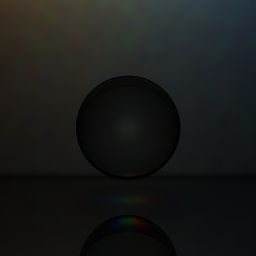
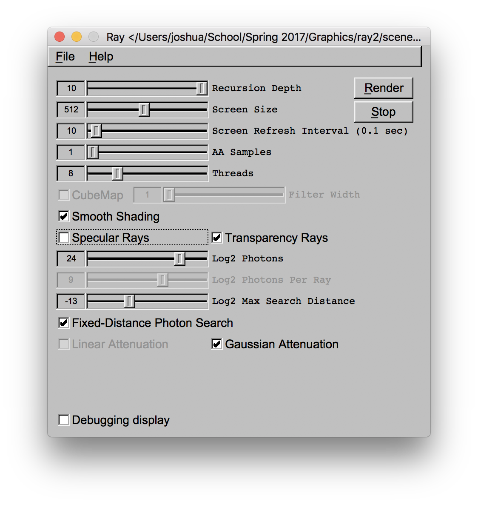
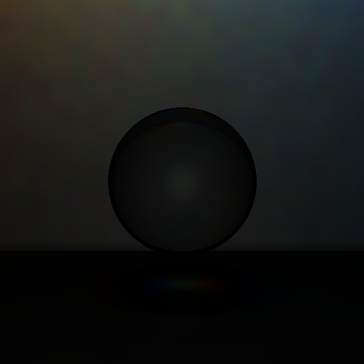
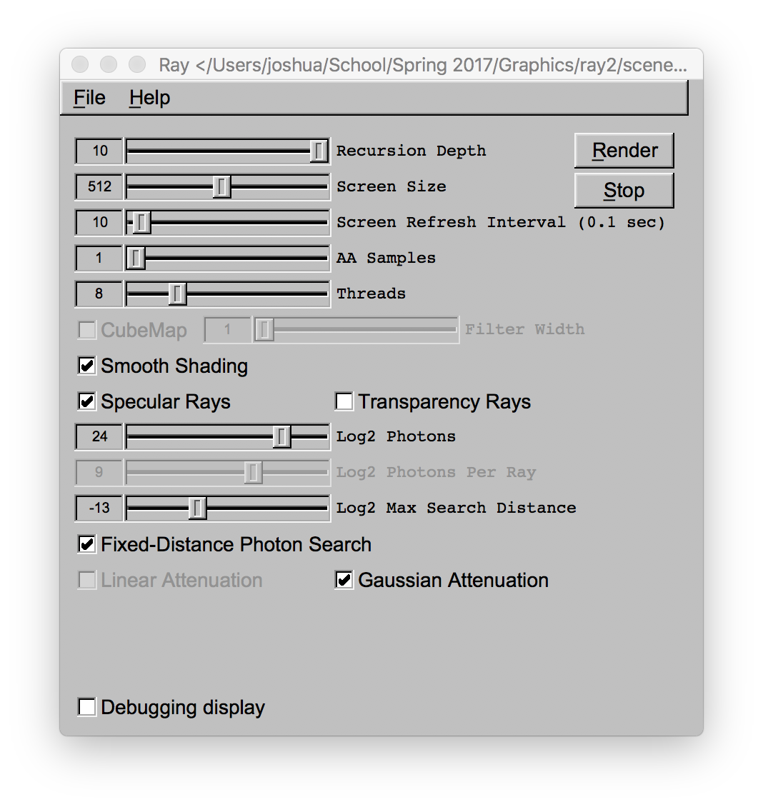
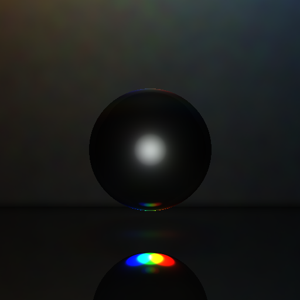
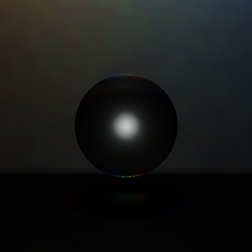
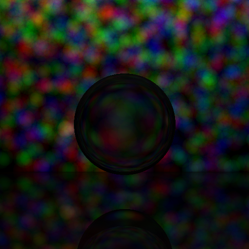

# PathTracing
This project is a modification of my ray tracer to support path tracing.

## Background and Accomplishments

Path tracing is a complex process involving a number of stages to produce a final output. At a high level, I use a Monte Carlo-based path tracing algorithm to spread photons around a scene and then integrate the power of these photons to determine luminosity at any particular point. 

### Advantages of Monte Carlo Path Tracing

Randomized algorithm massively reduce space and time requirements to converge on a final result. In a standard ray tracer, any time a ray hits a surface it will be reflected and transmitted until we hit a maximum depth or the contribution to the original pixel is irrelevant. However, this results in a massive number of total rays being spawned. While this amount of computation can be tolerable, we do not have to deal with the conseqeunces of storing all these rays at once as we can explore ray paths in a depth-first manner. This is hard, if not impossible, to do with path tracing. By using randomization, we can choose to reflect, transmit, or absorb a photon based on the probability of each action occuring. This means that each initial photon does not spawn more photons, preventing an exponential increase in photon count. This also prevents the presence of low-energy photons, which can have adverse effects on performance and quality of results.

### Light Emission

Light emission is actually quite tricky under these contraints. We want to spawn photons equally in all directions, but only care about photons that actually hit a surface in our scene. When we have multiple light sources, we also want all photons spawned to have a roughly equal power (power being light color divided by the total number of photons spawned). To accomodate both of these requirements, we first sample how often photons emitted by each light actually hit a surface (which I will refer to as a light's "efficiency"). From there, we weight the number of photons spawned by each light by the relative power and efficiency of each light source. This way each light emits photons of roughly equal intensity without having to use light intensity estimates. Since light is emitted equally in all directions, we automatically get distance attenuation for free as farther surfaces will receive fewer photons. We allow users to control the number of photons generated (that actually hit surfaces) in our UI.

### Photon Propagation

Once the photons have been emitted, we propagate them through the scene. When a photon hits a surface, it can do one of four things: (1) be diffusely reflected, (2) be specularly reflected, (3) be transmitted, and (4) be absorbed. To determine which of these events occur, we start by gathering the properties of the material hit by the photon. To deal with multiple color channels, we sum the probabilities by color channel and take the maximum to define the probability of anything but absorbtion happening. We then weight the chance of (1), (2), or (3) happening by the relative weight of the sum of each action's probability across all channels. These probabilities should not add up to more than 1 assuming the material was defined properly. Any leftover probability is assigned to the probability of absorbtion. We can then use a random number generator to choose which of the actions happens. As a final step, if the photon is not absorbed, we must also calculate its new power. This is done by taking the old power of the photon and multiplying each channel by that channel's probability of the chosen even occuring, divided by the actual probability used.

### Photon Storage

To recall these photons later, we store them at every surface interaction. I used a data structure similar to an R-tree, but with bounding spheres instead of bounding boxes. This makes is easy to calculate maximum and minimum distances when searching for photons later. This data structure is local to each object in the scene to prevent objects picking up photons interacting with nearby objects. The exception to this is meshes, where the tree is for all photons interacitng with the mesh since there may not be enough photon samples per triangle.

### Rendering

We discovered there were a variety of ways to shade a material with path tracing. Some methods only use the stored photons for caustics, while others use them most of the lighting features. In our code, we experimented with many different approaches and expose them to the user. In the simplest case, we treat photons similar to light sources in the Phong shading model and integrate only the light present near the ray / surface intersection. However, effects like specular reflection and transmission do not always come out well this way. Therefore we also allow for these effects to be handled by using specular and transmissive rays to better simulate these effects. We also allow users to control the maximum number of photons to be integrated by specifing a maximum number of photons and a maximum search distance. It is also possible to fix the maximum search distance so that all photons in this range are considered instead of a variable number based on actual photons found. To account for the fact that more photons will be found in a larger search area, we assume the photons lie on a plane and divide by the circular area (even though we search in a sphere).  We also expose a number of smoothing methods to the user. Photons farther from the point of ray impact can be attenuated using a linear filter, a gaussian filter, or no filter at all.

## Renders

Settings | Output
:---: | :---:
 | 
 | 
 | 
 | 
 | 
